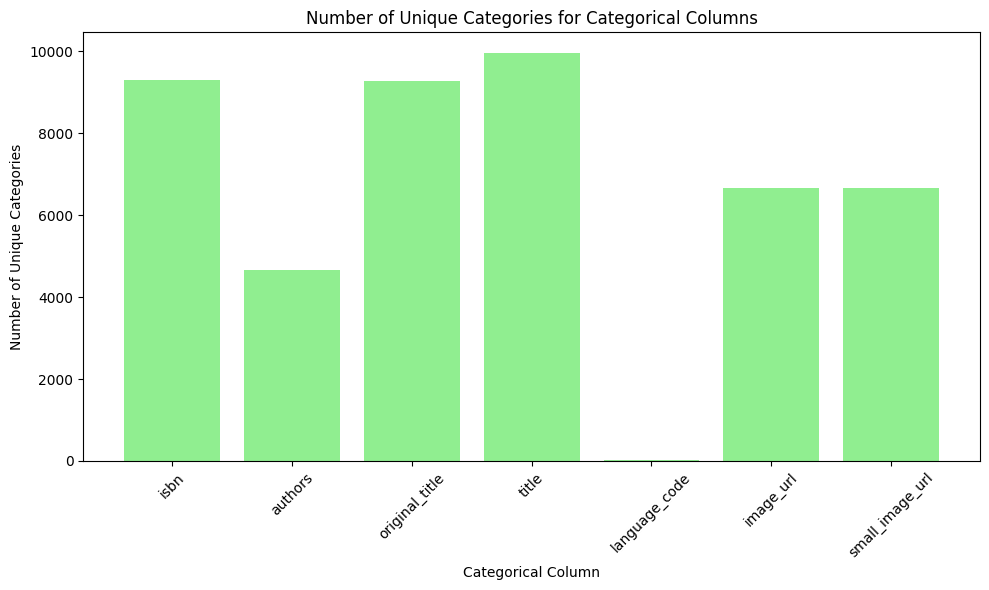
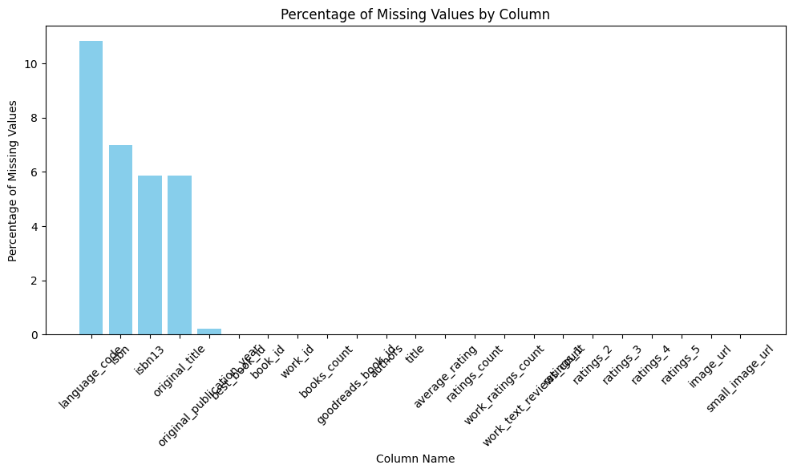
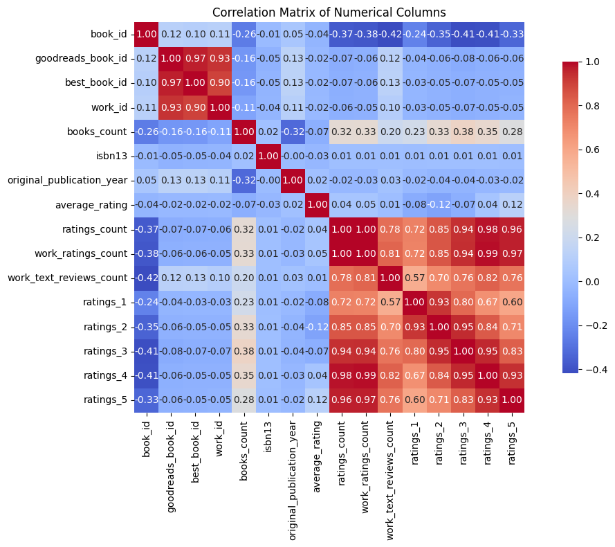
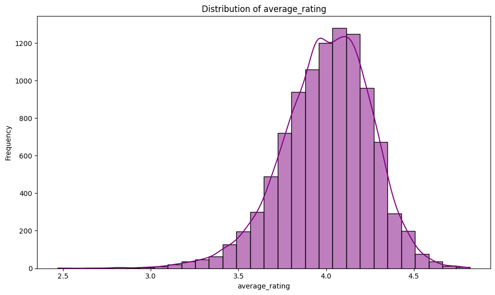
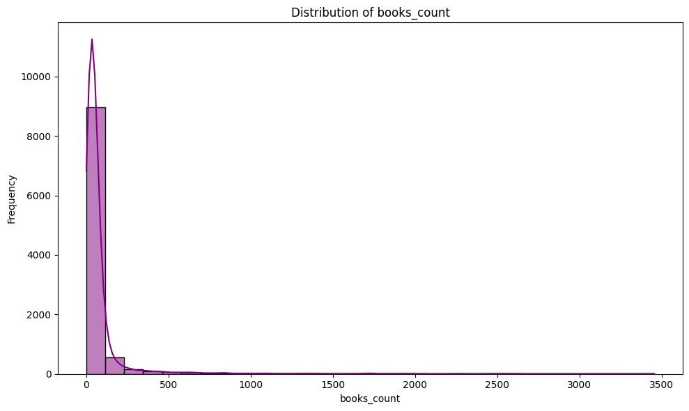
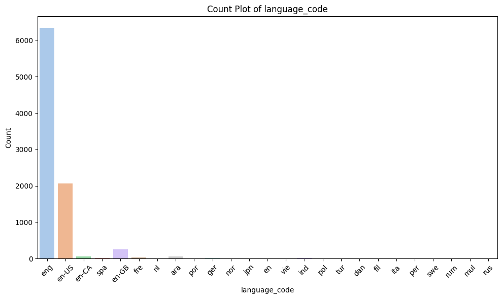

# Goodreads Book Dataset Analysis

## Introduction
The Goodreads dataset presents a rich collection of information about various books, which allows for extensive exploration and insightful analysis regarding authors, reader engagement, and publication trends. With a total of 10,000 entries, the dataset includes a variety of numerical and categorical variables, enabling a comprehensive understanding of the world of books and their receptions by readers. This analysis will delve into the dataset's structure, examine individual columns, provide visualizations, and offer recommendations based on the findings.

---

## Data Overview

### Numerical Columns
The dataset comprises several numerical columns which are crucial for understanding book attributes:
- **book_id**: Unique identifier for each book.
- **goodreads_book_id & best_book_id**: IDs that link books to Goodreads and best books lists, respectively.
- **work_id**: Identifies the work to which the book belongs.
- **books_count**: Total quantities of books associated with each entry.
- **isbn13**: The 13-digit International Standard Book Number.
- **original_publication_year**: The year each book was originally published.
- **average_rating**: The average rating given to the book by users.
- **ratings_count**: Total number of ratings the book has received.
- **work_ratings_count**: Rating count for the entire work.
- **work_text_reviews_count**: Count of text reviews of the work.
- **ratings_1 to ratings_5**: Distribution of ratings from 1-star to 5-star.

#### Summary Statistics of Numerical Columns
A summary of the numerical columns reveals significant insights into the dataset's trends:

- The average book has a **books_count** of approximately **75.71**, emphasizing the wide range of book editions available.
- The data shows that the average rating across books is around **3.74**, suggesting a generally positive reception among readers, with an average **ratings_count** of approximately **1345** indicating high engagement.
- **original_publication_year** reflects that books span multiple decades, providing a temporal perspective on reading trends.

### Categorical Columns
The categorical columns provide qualitative insights into the dataset:
- **isbn**: A unique identifying number for the book.
- **authors**: The authors of the respective books, with notable contributions from various prolific writers.
- **original_title & title**: Titles of the books, often adding cultural and contextual significance.
- **language_code**: Indicates the languages in which the books are available.
- **image_url & small_image_url**: Links to book cover images, enhancing visual engagement.

#### Summary Statistics of Categorical Columns
- The authors' field reveals **over 4600 unique authors**, with Stephen King being the most frequently represented author with **60 occurrences**.
- The dataset contains **9300 unique ISBNs**, indicating a robust cataloging of individual editions.
- The **language_code** column indicates a linguistic diversity, but it also shows a missing percentage of **10.84%**, highlighting potential areas for improvement in data completeness.

### Missing Values
Despite the generally well-structured data, some columns possess missing values:
- **isbn** is missing for **7%** of entries.
- **language_code** has a notable **10.84%** missing, which could hinder analyses related to linguistic trends in book popularity.

---

## Correlation Analysis
Examining the correlation matrix helps identify relationships between numerical variables. Here are some notable findings:

- **ratings_count** shows a strong positive correlation with all ratings (from **ratings_1** to **ratings_5**). This suggests that higher overall ratings likely lead to increased counts of individual ratings, which can be indicative of user engagement.
- **average_rating** has moderate correlations with **ratings_4** and **ratings_5** (approximately **0.115**), implying that better average ratings are linked with higher 4-star and 5-star ratings.

---

## Visualizations
Several visualizations provide a deeper understanding of the data:

1. **Distribution of Average Rating**
   The distribution of average ratings shows a left-skewed distribution, suggesting that most books receive favorable ratings.

   

2. **Books Count Distribution**
   The distribution of books count per entry indicates a long-tail effect, where a few books have a significantly higher number of editions than the majority.

   

3. **Language Code Count Plot**
   A visual representation of the distribution of books across different languages demonstrates a strong representation in English, with other languages showing less diversity.

   

---

## Insights and Recommendations
Based on the analysis, several insights emerge:
1. **Author Popularity**: Stephen King’s prominence indicates that genre-specific books can lead to skewed popularity. Therefore, exploring niche genres could enlarge market opportunities.
2. **Language Coverage**: Addressing the **10.84%** missing values in **language_code** is crucial for enhancing reach. Consider including translations or editions in languages where ratings might differ significantly.
3. **Engagement Strategies**: Books with higher average ratings should be promoted through social media and reading clubs to enhance visibility and engagement.

---

## Conclusion
The analysis of the Goodreads dataset reveals rich storytelling potential embedded in the data. By understanding the relationships between various attributes and addressing data completeness, developers and analysts can create compelling strategies that enhance reader engagement and improve book offerings. As the literary landscape continues to evolve, utilizing this dataset effectively could contribute significantly to literary trends and reader experiences. 

By maintaining best practices in data management and utilizing ongoing improvements in data collection, the implications of this dataset can lead to informed decisions that resonate with readers.

---

## References
- Goodreads Book Dataset
- Statistical Analysis Techniques

### Visual Assets
Please ensure to utilize the relevant visual plots for enhanced understanding. All images are included for a comprehensive analysis experience.
