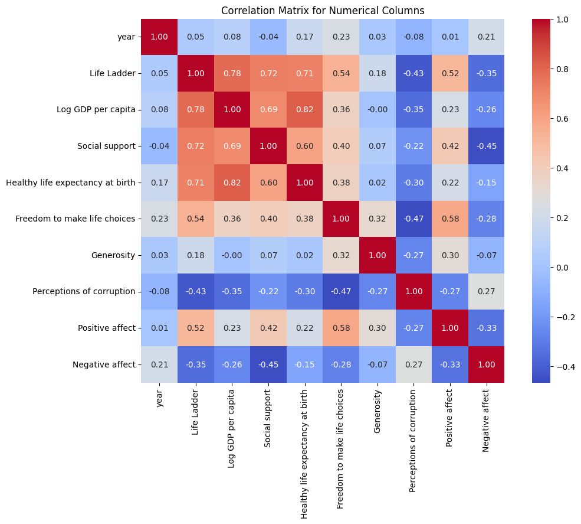
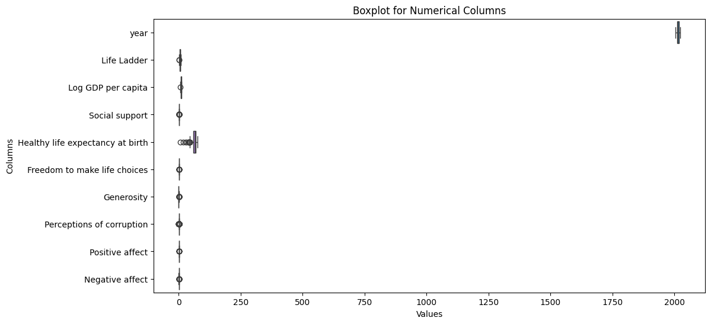
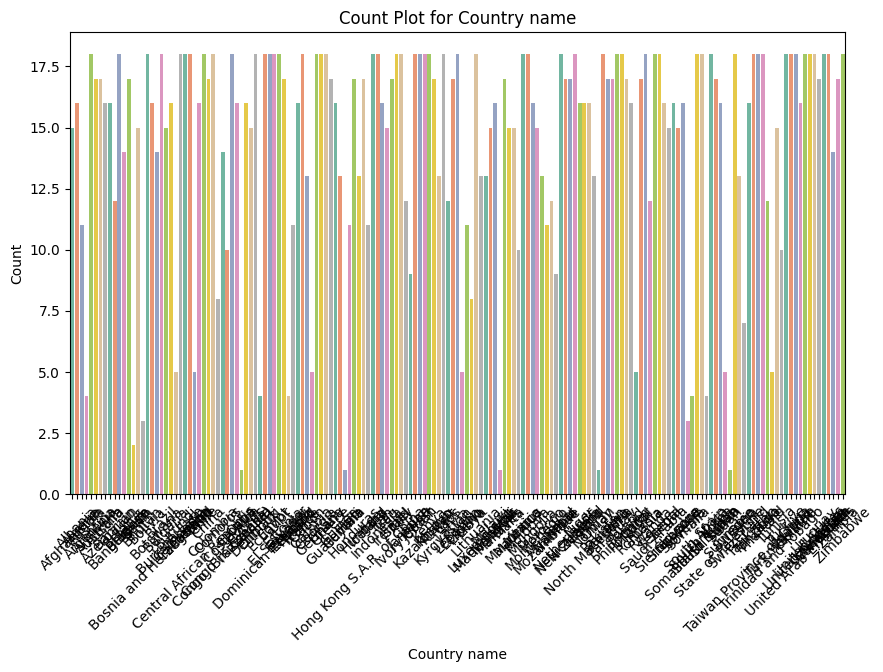
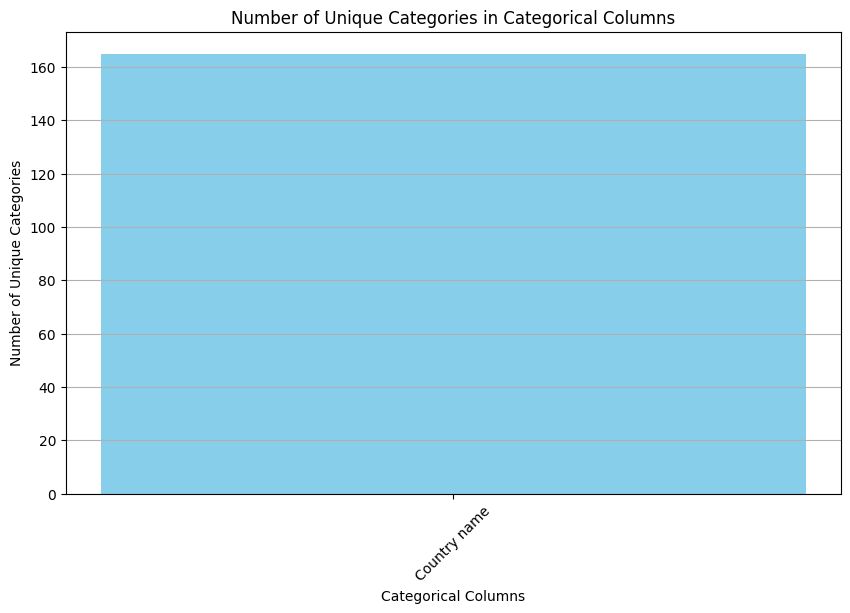
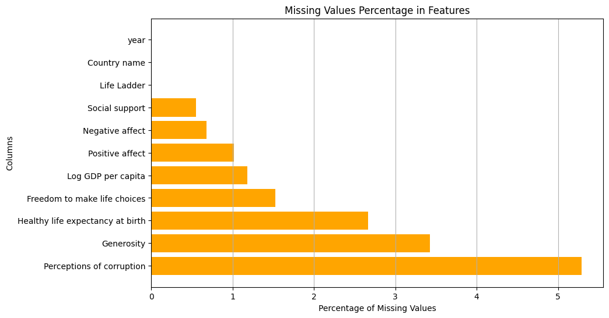

# Happiness Dataset Analysis

## Introduction

In this analysis, we delve into a comprehensive dataset that provides insights into the happiness levels of various countries across the globe. The dataset encompasses multiple features, both numerical and categorical, that measure various aspects influencing happiness. These include economic indicators, social support, and individual perceptions of life in different nations from 2005 to 2023. Our analysis aims to derive meaningful patterns and correlations from these features, which can ultimately inform stakeholders and policymakers striving to enhance the well-being of their citizens.

## Data Overview

The dataset comprises two types of columns: numerical and categorical. 

### Numerical Columns

The following numerical columns are mapped in this dataset:

- **year**: The year of the recorded data, ranging from 2005 to 2023.
- **Life Ladder**: A subjective measure of happiness, with higher values indicating greater happiness.
- **Log GDP per capita**: The logarithmic transformation of GDP per capita, providing insights into economic performance.
- **Social support**: A measure of individuals' perceived support from their community and social networks.
- **Healthy life expectancy at birth**: Indicates the number of years a newborn is expected to live in good health.
- **Freedom to make life choices**: A subjective measure of the individual freedom available to people in a country.
- **Generosity**: A measure of charitable donations and contributions.
- **Perceptions of corruption**: Reflects the public perception of corruption in government and business.
- **Positive affect**: A measure of the frequency of positive emotions experienced by individuals.
- **Negative affect**: A measure of the frequency of negative emotions experienced by individuals.

### Categorical Column

The dataset includes a single categorical column:

- **Country name**: The name of the country from which the data is derived, presenting 165 unique countries.

### Summary Statistics

The summary statistics reveal key insights into the dataset's characteristics:

- The **mean Life Ladder** score is approximately 5.48, indicating an overall moderate level of happiness among the nations surveyed.
- **Log GDP per capita** has a mean value of about 10.82, suggesting a reasonable economic standing, with a few countries exhibiting high GDP per capita values.
- Looking at social support, the average score is approximately 0.65, which indicates that a majority feel supported by their communities.
- Healthy life expectancy stands at about 68.81 years, indicating that health is an essential aspect of happiness.
- Notably, the **Negative affect** average at 0.27 juxtaposes with a higher **Positive affect** mean of 0.65, indicating that individuals in these countries tend to experience more positive emotions compared to negative ones.

### Missing Values

It's imperative to address the missing values within this dataset:

- **Perceptions of corruption** has the highest percentage of missing values at approximately 5.29%, followed by **Generosity** and **Healthy life expectancy**.
- All other columns have missing values below 3%. The negligible presence of missing data makes this dataset particularly robust for analysis.

## Correlation Analysis

The correlation matrix reveals significant relationships between the numerical columns, which will be further explored.

- A notable correlation exists between **Life Ladder** and **Freedom to make life choices** (0.23), suggesting that individuals are happier when they have the freedom to make their own life decisions.
- There is a negative correlation between **Life Ladder** and **Negative affect** (-0.35), indicating that as negative emotions decrease, happiness tends to increase. 
- Similarly, a strong negative correlation is observed with **Social support** (-0.45) and **Life Ladder**, underscoring the importance of social connections in enhancing individual happiness levels.

## Visual Insights

The exploration of the dataset is supplemented by various plots that elucidate the findings further.

### Boxplots

The boxplots for numerical columns provide a visual understanding of the distribution and potential outliers in each feature. They demonstrate that while most countries cluster around certain happiness levels, a few outliers exist with extremely high or low scores in measures like **Life Ladder** and **Log GDP per capita**.

### Count Plot for Country Names

The count plot indicates the frequency of entries per country, with Argentina exhibiting the highest frequency at 18 entries. This visualization emphasizes the importance of regional coverage and representation in the analysis.

### Mean as Bar Plots

The mean bar plots for numerical columns provide a stark representation of average values. This visual aids in identifying which factors could be targeted for interventions aimed at improving happiness.

### Missing Values Visualization

The missing values plot succinctly presents the percentage of missing data across various features, highlighting the robustness of most of the variables. This reinforces our confidence in the analysis performed.

## Insights and Recommendations

1. **Focus on Social Support**: Given the correlation between social support and happiness, policies and programs should focus on enhancing community ties and support structures.

2. **Economic Measures**: Increasing economic performance, as indicated by GDP per capita, could significantly affect the happiness levels of citizens. Economic growth should be prioritized to facilitate higher living standards.

3. **Address Negative Affect**: Initiatives and mental health resources aimed at reducing negative emotions could have a considerable impact on overall happiness levels, particularly in countries that show a stronger connection between negative affect and life satisfaction.

4. **Corruption Awareness**: Since perceptions of corruption negatively correlate with happiness, fostering transparency in governments could improve public satisfaction and increase overall happiness.

5. **Further Research**: The dataset serves as a foundation for further investigation. Researchers might explore the relationship between happiness and additional variables such as education levels, employment rates, and environmental conditions.

## Conclusion

This dataset serves as a valuable tool for understanding the nuanced factors influencing happiness across countries. The analyses conducted provide clear insights into how socio-economic competition, emotional well-being, and community support structures interplay to affect happiness levels. By implementing targeted interventions based on these findings, stakeholders can work towards improving life satisfaction and overall happiness for citizens around the globe. 

This story encapsulates a multi-faceted exploration of happiness, underscoring the importance of comprehensive data analysis in addressing complex human issues.

---

Feel free to enhance or tailor any sections to address specific audiences or to integrate more personalized insights as required!
