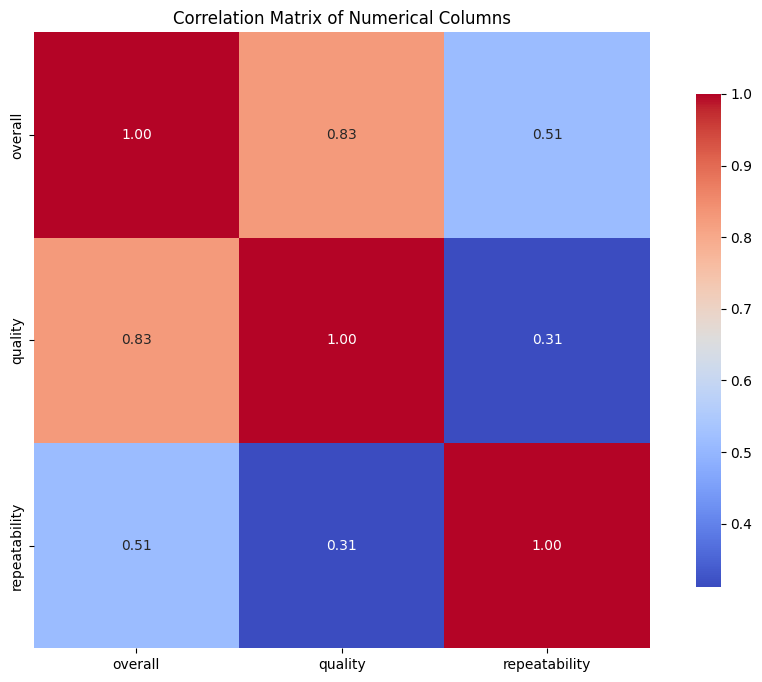

# Data Analysis and Insights on Movie Ratings Dataset

## Introduction
In this analysis, we explore a dataset comprising reviews for various movies. The dataset contains both numerical and categorical columns, providing a comprehensive view of movie ratings along with metadata like release date, language, type, title, and reviewer information. Our goal is to analyze the data, extract insights, and provide recommendations based on our findings.

---

## Dataset Overview

### Numerical Columns
The dataset consists of three numerical features:
- **Overall**: A score reflecting the reviewer's overall impression of the movie.
- **Quality**: Indicates the quality of the movie as perceived by the reviewer.
- **Repeatability**: A score indicating whether the reviewer would want to watch the movie again.

| Statistic   | Overall   | Quality   | Repeatability |
|-------------|-----------|-----------|---------------|
| Count       | 2652      | 2652      | 2652          |
| Mean        | 3.05      | 3.21      | 1.49          |
| Std Dev     | 0.76      | 0.80      | 0.60          |
| Min         | 1.00      | 1.00      | 1.00          |
| 25%         | 3.00      | 3.00      | 1.00          |
| Median      | 3.00      | 3.00      | 1.00          |
| 75%         | 3.00      | 4.00      | 2.00          |
| Max         | 5.00      | 5.00      | 3.00          |

The mean ratings for `Overall` and `Quality` are slightly above average, hovering just above 3 out of 5. Notably, the `Repeatability` score suggests that viewers are less likely to rewatch the films, as the average rating is below 2, indicating that many rated movies do not inspire a desire to watch them again.

### Categorical Columns
The categorical features in the dataset include:
- **Date**: Review date.
- **Language**: The language in which the movie was produced.
- **Type**: The type of movie (e.g., movie, series).
- **Title**: The title of the movie.
- **By**: The name of the reviewer.

| Statistic  | Date      | Language | Type   | Title              | By                |
|------------|-----------|----------|--------|--------------------|-------------------|
| Count      | 2553      | 2652     | 2652   | 2652               | 2390              |
| Unique     | 2055      | 11       | 8      | 2312               | 1528              |
| Most Common| 21-May-06 | English  | Movie  | Kanda Naal Mudhal  | Kiefer Sutherland  |
| Frequency  | 8         | 1306     | 2211   | 9                  | 48                |

### Missing Values
The dataset has some missing values, which could impact our analysis:
- Date: 3.73%
- By: 9.88%

This percentage of missing data in the `By` column, in particular, is noteworthy and may affect the analysis of reviewer trends and patterns.

### Correlation Analysis
We computed the correlation coefficients between the numerical variables:

|                | Overall  | Quality  | Repeatability |
|----------------|----------|----------|---------------|
| Overall        | 1.00     | 0.83     | 0.51          |
| Quality        | 0.83     | 1.00     | 0.31          |
| Repeatability   | 0.51    | 0.31     | 1.00          |

The high correlation (0.83) between `Overall` and `Quality` suggests that reviewers tend to rate movies higher when they perceive them to be of good quality. In contrast, `Repeatability` shows a weaker correlation with both `Overall` and `Quality`, indicating that even movies with high ratings may not necessarily encourage viewers to rewatch them.

---

## Visualizations
To better understand the dataset, we created several visualizations.

### Boxplot of Numerical Columns
The boxplot visualization shows the distribution of ratings for overall, quality, and repeatability.

### Correlation Matrix
The correlation matrix visually represents the relationships between numerical features.

### Count Plot of Review Dates
This plot highlights the distribution of review dates, indicating patterns in when reviews are submitted.

### Histograms for Numerical Features
The histograms display the frequency distribution of the overall ratings, quality ratings, and repeatability scores.

### Mean as Bar Plots
Bar plots illustrating mean ratings provide an intuitive understanding of average scores across the numerical columns.

### Missing Values Visualization
This plot illustrates the percentage of missing values in the dataset, emphasizing the areas that may need attention.

---

## Insights and Recommendations
1. **Quality and Overall Ratings**: The high correlation between overall scores and quality indicates that filmmakers should prioritize producing quality content to achieve better ratings.
2. **Repeatability**: The low repeatability scores suggest that while films may be perceived as good, they may not possess exceptional qualities that encourage viewers to watch them again. Focusing on unique narratives or exceptional performances could enhance this aspect.
3. **Handling Missing Values**: There is a notable percentage of missing data in the `By` column. Conducting further analysis on reviewer trends would benefit from addressing these gaps, either by imputing missing values or using advanced modeling techniques.
4. **Diverse Language Representation**: The dataset features reviews in 11 languages; however, the majority of reviews are in English. This could suggest a potential for broader outreach and engagement with non-English speaking audiences.

---

## Conclusion
This dataset offers valuable insights into movie ratings, revealing trends and correlations that can guide filmmakers and marketers. By focusing on quality, minimizing gaps in data, and addressing repeatability, stakeholders in the film industry can leverage this information to enhance their production and engagement strategies.

---