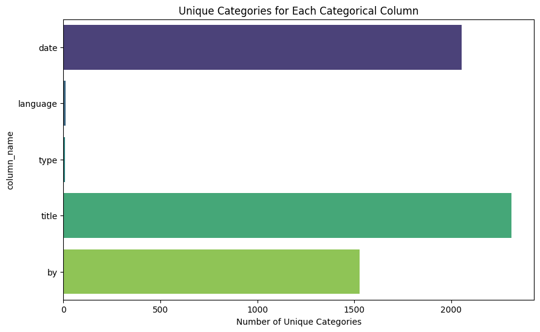

```markdown
# Comprehensive Analysis of the Dataset

## Introduction

In today's data-driven world, it is crucial to analyze and interpret datasets effectively to derive meaningful insights. This report provides a detailed analysis of a dataset consisting of both numerical and categorical variables. We will explore the relationships between variables, visualize the data, and discuss the insights derived from this analysis.

## Dataset Overview

The dataset consists of **2652 entries** and includes the following columns:

### Numerical Columns:
- **overall**: A score representing an overall rating, ranging from 1 to 5.
- **quality**: A score representing the quality rating, also on a scale from 1 to 5.
- **repeatability**: A metric indicating consistency in scores, ranging from 1 to 3.

#### Summary Statistics of Numerical Columns
The summary statistics of numerical columns provide insight into the distribution and central tendency of the data:

| Statistic   | Overall | Quality | Repeatability |
|-------------|---------|---------|---------------|
| **Count**   | 2652    | 2652    | 2652          |
| **Mean**    | 3.05    | 3.21    | 1.49          |
| **Std Dev** | 0.76    | 0.80    | 0.60          |
| **Min**     | 1.00    | 1.00    | 1.00          |
| **25%**     | 3.00    | 3.00    | 1.00          |
| **50%**     | 3.00    | 3.00    | 1.00          |
| **75%**     | 3.00    | 4.00    | 2.00          |
| **Max**     | 5.00    | 5.00    | 3.00          |

From the summary, we observe that:
- The mean rating for both **overall** and **quality** is slightly above 3, indicating a generally favorable perception.
- The **repeatability** metric shows most entries score a 1, suggesting a potential issue with consistency in ratings.

### Categorical Columns:
- **date**: The date field contains a variety of dates reflecting when entries were recorded.
- **language**: The language is predominantly English.
- **type**: A classification indicating the type of content, with the majority being movies.
- **title**: The titles of the entries, with a total of 2312 unique titles.
- **by**: The entity or individual responsible for the entries, with 1528 unique contributors.

#### Categorical Summary
- The **date** column has a notable amount of missing data, with **3.73%** missing entries.
- The **by** column has the highest percentage of missing values at **9.88%**.
- Other categorical fields like **language**, **type**, and **title** have no missing values, indicating good data integrity in those areas.

## Missing Data Analysis
The following table summarizes the missing data percentage in the dataset:

| Column Name | Percentage Missing |
|-------------|--------------------|
| Date        | 3.73               |
| Language    | 0.00               |
| Type        | 0.00               |
| Title       | 0.00               |
| By          | 9.88               |
| Overall     | 0.00               |
| Quality     | 0.00               |
| Repeatability| 0.00              |


Analyzing missing values is crucial; we may need to handle the missing entries in the **date** and **by** columns through imputation or exclusion depending on their importance in our study.

## Correlation Analysis
The correlation matrix highlights the relationships among numerical variables:

|            | Overall  | Quality  | Repeatability |
|------------|----------|----------|---------------|
| Overall    | 1.000    | 0.826    | 0.513         |
| Quality    | 0.826    | 1.000    | 0.312         |
| Repeatability| 0.513  | 0.312    | 1.000         |

From the analysis:
- There is a strong positive correlation (0.83) between **overall** and **quality**, suggesting that as the quality rating increases, so does the overall rating.
- **Repeatability** shows a moderate correlation with both **overall** and **quality**, indicating some level of consistency in how entries are rated.

### Correlation Matrix Visualization


## Visualizations
The following visualizations help in understanding the distribution and relationships of our dataset:

1. **Boxplot of Numerical Columns**:
    
    This boxplot indicates the spread and potential outliers in the numerical data. Most values concentrated around scores of 3 show a relatively consistent rating without extreme outliers.

2. **Histograms**:
    - **Histogram of Overall Ratings**:
        
        A majority of the entries are clustered around the score of 3, showing a left skew.
    
    - **Histogram of Quality Ratings**:
        
        Similar to overall ratings, the quality ratings also show that most scores are found in the lower range.
    
    - **Histogram of Repeatability**:
        
        The ratings for repeatability show that most entries have a score of 1, suggesting lots of entries rated consistently.

3. **Mean as Bar Plots**:
    
    This type of plot summarization reveals how the average ratings differ across the three numerical columns, offering a quick comparison.

## Key Insights
- The dataset shows promising overall and quality ratings; however, many entries exhibit a lack of repeatability, indicating a need for improved consistency in ratings.
- Categorical data also show good integrity, but there are areas that require attention, especially regarding missing values.
- The significant correlation between overall and quality ratings can inform future analysis and predictive modeling.

## Recommendations
1. **Address Missing Data**: It is essential to handle missing values in the **date** and **by** columns. Consideration should be given to imputing with appropriate methods based on the context of the dataset.
2. **Investigate Repeatability**: The low repeatability score suggests that users might not be rating consistently. This could be due to various factors, including ambiguity in what ratings represent. Further inquiry into how ratings are collected could improve data consistency.
3. **Deepen Analysis**: Building models to predict overall ratings using quality and repeatability can yield valuable insights and enhance understanding of the factors influencing overall perceptions.
4. **Increase Sample Size**: To account for the potential bias given the existing dataset and improve the robustness of insights, consider collecting more data.

## Conclusion
This detailed exploration of the dataset not only unveils underlying patterns and relationships but also highlights areas that require further investigation. By addressing the issues raised and leveraging the insights gained, we can enhance the quality of analysis and foster data-driven decisions moving forward.

--- 
```
